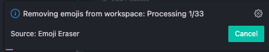
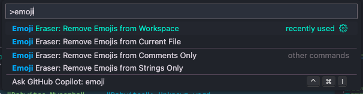
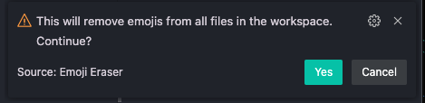

# Emoji Eraser

[](https://github.com/dvbwitso/emoji-eraser/actions/workflows/ci.yml)
[](https://opensource.org/licenses/MIT)
[](https://marketplace.visualstudio.com/items?itemName=DabwitsoMweemba.emoji-eraser)
[](https://marketplace.visualstudio.com/items?itemName=DabwitsoMweemba.emoji-eraser)

A lightweight **VS Code extension** that removes all emojis from your codebase. Keep your code clean, professional, and emoji-free—perfect for teams, APIs, or projects where emojis accidentally sneak into strings, comments, or markdown in this LLM era.

---

## Features

### Core Features
- **Single File Emoji Removal**  
  Remove all emojis from the currently active file with a single command.  

- **Workspace-Wide Emoji Removal**  
  Scan your entire workspace and clean emojis in bulk.  
## Emoji Eraser — Remove unwanted emojis from your code instantly

[](https://github.com/dvbwitso/emoji-eraser/actions/workflows/ci.yml)
[](https://opensource.org/licenses/MIT)
[](https://marketplace.visualstudio.com/items?itemName=DabwitsoMweemba.emoji-eraser)
[](https://marketplace.visualstudio.com/items?itemName=DabwitsoMweemba.emoji-eraser)

A tiny, fast VS Code extension to remove emojis from source files, comments, and markdown. Ideal for teams, CI pipelines, and projects that need clean, professional text.



Why this extension?
- Keep codebases professional and machine-readable.
- Prevent accidental emojis in docs, API strings, or log messages.
- Simple UX: one command per scope and optional previews.

---

### Quick summary
- Name: Emoji Eraser — Remove unwanted emojis from your code instantly
- Tags / keywords: emoji, remove, formatter, lint, productivity, ai, code-quality
- Categories: Formatters, Linters

---

## Features

- Single-file removal (current file)
- Workspace-wide removal (bulk)
- Selective removal: comments only, strings only, or everywhere
- Preview changes and use VS Code undo
- Counts and summaries after runs
- Lightweight and configurable (file-type filters)

---

## Try it (commands)

- Remove Emojis from Current File — `emoji-eraser.removeFromFile`
- Remove Emojis from Workspace — `emoji-eraser.removeFromWorkspace`
- Remove Emojis from Comments Only — `emoji-eraser.removeFromComments`
- Remove Emojis from Strings Only — `emoji-eraser.removeFromStrings`

Open the Command Palette (Ctrl/Cmd+Shift+P) and type the command name.

## Before / After example

Before (string with emoji):

```ts
const message = "Deploy completed ✅ — all services running";
// comment: this is great 😄
```

Run Emoji Eraser (current file) → After:

```ts
const message = "Deploy completed  — all services running";
// comment: this is great 
```

---

## Visuals

Placeholders below show where screenshots/GIF/video will appear on the Marketplace page. Replace these with real recordings or high-quality screenshots (suggested sizes: 1280×720 for videos/GIFs, 880×660 for images).





---

## Installation & development

```bash
git clone https://github.com/dvbwitso/emoji-eraser.git
cd emoji-eraser
npm install
npm run compile
code .
# Press F5 to launch Extension Development Host
```

---

## Contributing

Contributions welcome — open an issue with the feature idea or bug.

## License

MIT © Dabwitso Mweemba
